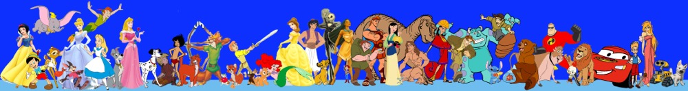
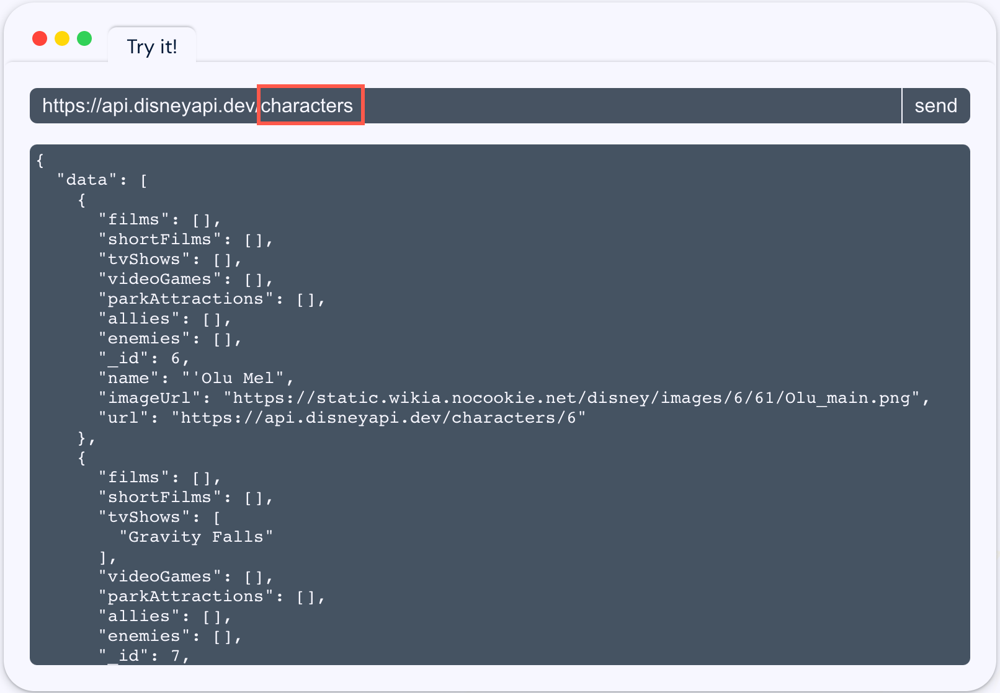
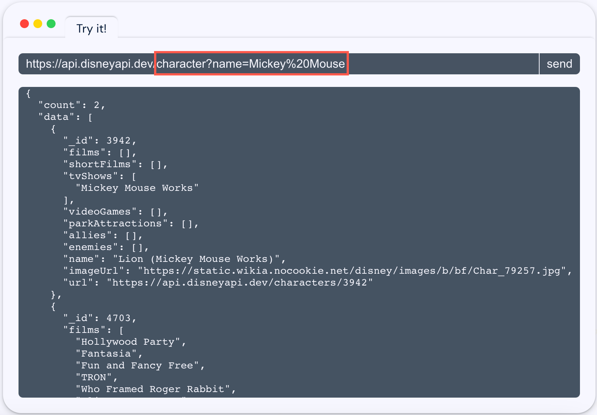

# PROPOSAL

## DISNEY CHARACTERVERSE

### OVERVIEW
The [Disney API](https://disneyapi.dev/) provides access to a wealth of information about Disney characters, including their names, descriptions, images, films, videogames and more. The functionality of the app will include the ability to register, login, favorite, and search for and view information on Disney characters.

### GOALS
My goal is to provide an online resource for people interested in learning about Disney characters. The site will allow users to search for and learn about their favorite Disney characters, as well as to discover new characters they may not be familiar with.

### TARGET USERS
The target demographic is primarily Disney fans, including both children and adults. I also expect that researchers, educators, and artists may also use the site for reference purposes.

### DATA
The data I plan on using is obtained from the [Disney API](https://disneyapi.dev/), which includes information on various Disney characters. I plan on incorporating all relevant data from the API into the database to create a comprehensive reference for users.

### APPROACH
#### Collection and Organization of Data
The main source of data will be obtained from the Disney API. I will also organize User Registration and Feedback into a centralized database.
#### Website Development
I will build a database-driven website using Python, Flask, Jinja, SQLAlchemy, WTForms, etc. to present the data in a clear and easy-to-use format.
#### Advanced Search and Filtering
I will create an advanced search and filtering system to allow users to easily find the characters they are looking for.
#### Database Schema

### USER FLOW
#### User Accounts
Users will create an account and have the ability to save their favorite characters.
#### Homepage
Users will be presented with a search bar and a list of popular characters to choose from.

#### Search Results
Users will be taken to a page displaying the results of their search.

#### Character Detail
By clicking on a character, users will be taken to a detail page displaying information on that character, such as name, description, and image.

### FEATURES BEYOND CRUD
The site will go beyond the standard CRUD functionality by offering advanced search and filtering capabilities. Additionally, the site will also incorporate visual aids such as images to enhance the user experience.

### STRETCH GOALS
1. Feedback: Users will have the option to submit feedback and corrections to the character data on the detail page.
2. Character Comparisons: Enable users to compare and contrast different Disney characters, such as their abilities, strengths, and weaknesses.
3. Character Quizzes: Create quizzes and trivia games based on Disney characters to engage users and test their knowledge.
4. Mobile App: Develop a mobile app version of the Disney Character Encyclopedia to provide users with an even more convenient and accessible way to access the information they need.
5. Historical Context: Add historical context to the character data, such as the release date of their first appearance and how their character has evolved over time.
6. Fan Art and Fan Fiction: Incorporate fan-created art and fan fiction into the character pages, allowing users to showcase their own creativity and passion for Disney.
7. Audio and Video: Add audio and video content to the character pages, such as clips from their movies and TV shows.