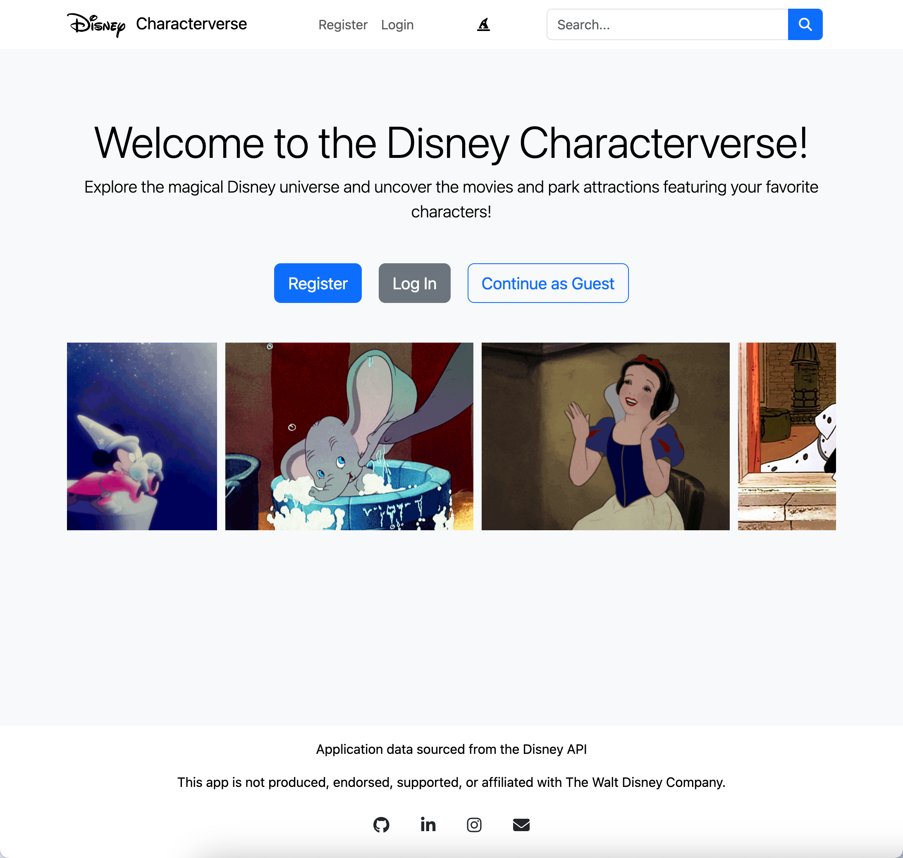

# Disney Characterverse


[Disney Characterverse](https://your-deployed-website-url.com) is a web application that allows users to explore, learn about, and save their favorite Disney characters.

## Description

Disney Characterverse is a platform for Disney fans to discover new characters and reminisce about their favorites. Users can browse through an extensive list of Disney characters, view movies, park attractions, and save their favorite characters to their profile.

## Features

- **Browse Characters**: Users can explore a vast collection of Disney characters and view detailed information about them.
- **Search Functionality**: Users can search for specific characters by name, or movie title.
- **User Authentication**: Users can register and log in to save their favorite characters.
- **Favorites List**: Users can save their favorite characters and access them on their profile page.

These features were implemented to create an engaging and personalized experience for users, allowing them to dive into the world of Disney characters and keep track of their favorites.

## User Flow

1. Users can view featured characters listed on the homepage.
2. Users can search for specific characters using the search bar.
3. To save favorite characters, users can register and log in.
4. Once logged in, users can click on a character to view more details and save them to their favorites list.
5. Users can access their favorites list on their profile page.

## API

The Disney Characterverse application utilizes the [Disney API](https://disneyapi.dev/) to fetch the list of Disney characters and their information. The API provides extensive information about each character, including their name, image, description, and more.

## Technology Stack

- **Front-end**: HTML, CSS, JavaScript, and Bootstrap
- **Back-end**: Python, Flask, and SQLAlchemy
- **Database**: PostgreSQL

## Additional Notes

Disney Characterverse is a passion project created for fellow disney fans. If you have any suggestions or feedback, please feel free to contribute to the project.

## How to Run
```
# Clone Repository
$ git clone https://github.com/hollyabrams/capstone-project-1.git
$ python3 -m venv venv
$ source venv/bin/activate
$ pip install -r requirements.txt
$ flask run
```
